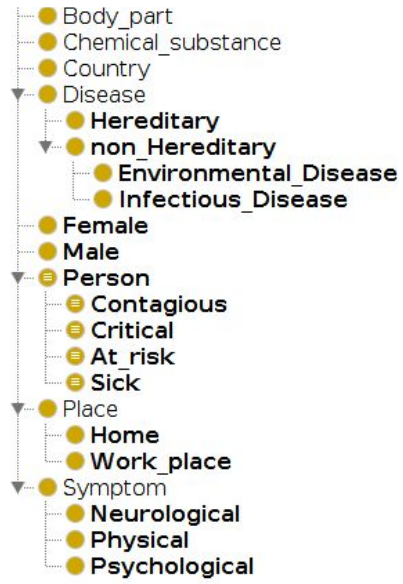
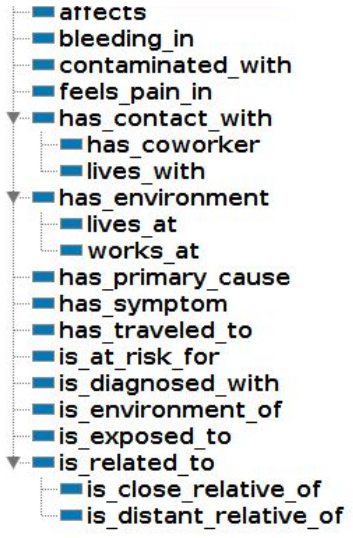
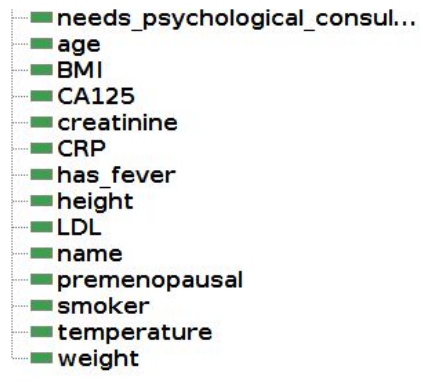
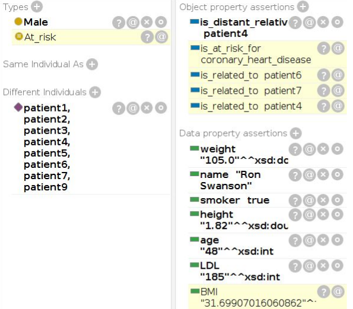
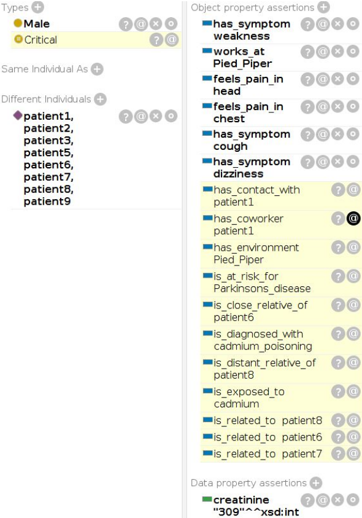

# AutoDoc
A medical ontology using patient info to infer what diseases they might have

## Overview
The purpose of this ontology is to infer what diseases a person might have based on available information about their symptoms, blood tests they have taken, and other personal details (height, weight, age). In a way, this ontology functions as an automated doctor (__*AutoDoc*__), diagnosing patients based on their symptoms and medical history.
Another point of interest is that the ontology also takes into account whether or not two patients have been in the same environment, or have had close contact or are related to each other. This helps to discover the risks one patient might be at, by considering common factors between them and other patients. 
* __*Please refer to the [user guide](https://github.com/Dorsa-Arezooji/AutoDoc/blob/master/AutoDoc_Manual.pdf) for more information.*__

## Applications
* This ontology could be of use to medical facilities such as clinics, hospitals, private practices, etc. Along with the patients’ information database, this ontology helps **identify eminent diseases** in patients. 
* Furthermore, it could be used as an **automated diagnostic tool** for patients who don’t have access to doctors.
* Another functionality of this ontology is **categorizing patients** based on their conditions into: *Sick*, *At-risk*, *Contagious* and *critical*. This helps to **prioritize medical care** to those in critical conditions, to **isolate contagious patients**, and **identify at-risk patients** and test them for diseases they might have.
* This ontology can be used to **identify locations that are contaminated** with heavy metals or other contaminants after diagnosing patients with environmental diseases caused by those contaminants. With the current Covid-19 crisis, the importance of identifying and sanitizing contaminated locations has risen.

## Ontology
The ontology is structured in the following way:
* __Classes__

* __Object Properties__

* __Data Properties__

## Results
The concepts related to each patient/place/disease can be inferred by running the `Pellet` reasoner in `Protege`.
For reference, here are the asserted and inferred concepts related to two patients:

